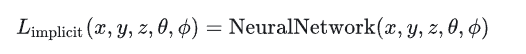
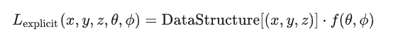
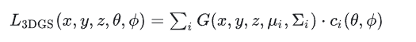

# TEST0-Implicit-Neural-Representation

## 0.重要概念

### **1.隐式重建**

**简述**：<u>使用***神经网络***来隐式地表示一个图像，而不是直接存储像素值。</u>然而我们无从得知这个连续函数的准确形式，因此有人提出用<u>神经网络来逼近这个连续函数，</u>这种表示方法被称为“隐式神经表示“ （Implicit Neural Representation，**INR**）。**相当于在隐式表征所代表的图像上运行的神经网络**

隐式神经表征是一种使用神经网络来表示复杂几何形状、场景或任何连续信号的方法，其中网络学习将坐标点（如三维空间中的位置）映射到相应的属性（如距离、密度或颜色）上。因此，对信号进行参数化所需的内存与空间分辨率无关，而只与底层信号的复杂度有关。

+++

详细介绍参考：[Github]([vsitzmann/awesome-implicit-representations: A curated list of resources on implicit neural representations. (github.com)](https://github.com/vsitzmann/awesome-implicit-representations?tab=readme-ov-file))

### **2.显示重建**

显式重建（Explicit Reconstruction）是指直接构建场景或物体的三维几何表示的过程，常见的形式包括[点云](https://so.csdn.net/so/search?q=点云&spm=1001.2101.3001.7020)、多边形网格（如三角形网格）和体素（三维像素）模型。这种方法直观、易于理解和操作，广泛应用于计算机图形学、3D打印、CAD和虚拟现实等领域。

​	**优势**：

- 直观性：显式模型易于可视化和编辑。
- 兼容性：与多数3D处理和渲染软件兼容。
- 实时性：点云和简单的多边形网格适用于实时应用。

​	**局限**：

- 复杂性管理：复杂场景的网格模型可能非常庞大，难以管理和处理。【数据量大，内存消耗】
- 拓扑变化：处理物体的拓扑变化（如断裂、合并）可能比较困难。【不够精细化】

### 3.辐射场

**辐射场：**辐射场有显示表达和隐式表达，可用于场景表示和渲染。可以理解为 <u>(𝑥,𝑦,𝑧,𝜃,𝜓)被映射到非负的辐射值</u> 

**隐式辐射场**：在NeRF中，使用MLP 网络用于将一组空间坐标 (𝑥,𝑦,𝑧) 和观察方向 (𝜃,𝜙) 映射到颜色和密度值。任何点处的辐射不是显式存储的，而是**通过<u>查询</u>神经网络实时计算得出**

**显式辐射场：**与隐式不同的是，显示是直接表示光在离散空间结构中的分布，比如体素网格或点云。该结构中的**每个元素都存储了其在空间中相应位置的辐射信息，而不是像NeRF一样去执行查询的操作**，所以他会更直接也更快的得到每个值，但是同时也需要更大内存使用和导致较低的分辨率。

**3D Gaussian Splatting：** 利用了显式辐射场和隐式辐射场的优势

**隐式表征使用MLP而非CNN的原因！：**

**CNN**具有**局部性**和**平移不变性**，

+ 局部性：CNN通过卷积层工作，<u>卷积层使用的是局部感受野</u>，即每个神经元只与输入数据的一个局部区域相连接。这意味着每个卷积核<u>只能捕捉其覆盖区域内的信息</u>，无法直接获取更广泛区域的全局信息。（即局部与局部之间的关系无法捕捉到）
+ 平移不变性：CNN能够<u>识别输入数据平移前后的相同特征</u>，无论特征在输入数据中的位置如何变化都能够识别，这适用于分类任务。

因此，当涉及到需要全局信息的建模任务时，如三维重建或者生成连续的几何表面，这两个特性（局部性和平移不变性）就可能成为限制。在这些任务中，**输入数据的每个部分都可能与整体结构紧密相关，需要网络能够理解和建模整个数据空间的复杂关系。**

而**INR隐式神经表征**尤其依赖于能够精确**捕捉全局连续性**，因为它们通常用于描述复杂的几何形状或场景的连续变化。很多隐式神经表征网络都是由MLP构成的，**MLP就是线性层套着激活函数**即使在离散采样中，MLP仍然能够提供一个连续的密度场。

+ 捕捉输入数据中的**全局特性**，这对于INR中的连续空间建模尤为重要。

**传统的隐式神经表征INR：**在应用场景和设计目标上，（如使用SIREN的网络）<u>更侧重于广泛的连续几何或功能形状的建模</u>，如解决图像或音频插值、三维形状重建等问题

**Nerf：**主要设计用于高质量的视觉渲染，特别是用于从稀疏的视角数据中<u>合成新的视角图像</u>。专门<u>针对光场渲染和计算机图形学</u>领域，侧重于视觉效果的精确度。

### 4.可微分光线追踪

**神经渲染：**使用**神经网络**生成或重建**三维空间中物体的<u>图像</u>**的技术。这个过程涉及到神经网络学习如何模拟<u>光线</u><u>与物体表面的交互</u>，从而能够从任意视角生成高质量的图像。Nerf中神经渲染确实涉及到对隐式神经表征（即网络学到的密度和颜色信息）进行**聚合**，以生成或重建图像。

**可微分光线渲染技术**

包括 **可微分光线追踪  +  颜色的计算、光照效果的合成**等。

可微分的光线追踪算法，SRNs**能够确保**从<u>任何新视角生成的图像在视觉上与已知视角一致</u>

**可微分光线追踪算法如何工作？**

可微分光线追踪算法通过模拟光线在三维场景中的路径来生成图像。

​	1.**光线投射**：

- 对于图像中的每一个像素，算法从虚拟摄像机的视点发射一条光线。这些光线根据摄像机的参数（如位置和方向）确定其路径。**（虚拟摄像机→发射光线→像素）**

​	2.**光线与场景的交互**：

- 光线与场景中的物体相交。这个**交点**的确定基于场景的几何描述，例如SRNs中用连续的函数隐式表示的场景。

​	3.**属性采样**：

- 在交点处，算法<u>评估</u>场景表示<u>函数</u>，**提取局部属性**如颜色、光亮度和反射特性。

​	4.**颜色累积**：

- **累积**沿光线路径收集的颜色和光照信息，计算最终像素的颜色值。

​	5.**梯度回传**：

- 由于整个过程是**可微分的**，可以根据最终图像与目标图像之间的误差**反向传播**梯度，优化场景表示以改善图像合成质量。

**可微分光线追踪与体渲染的区别  补充点渲染** 

+ **可微分光线追踪**侧重于通过<u>模拟光线</u>在三维空间中的精确路径并<u>与物体表面的交互</u>来渲染图像。（表面交互 如颜色）

+ **可微分光线渲染**：可微分光线追踪  +  颜色的计算、光照效果的合成 **SRN**   **找交点**，简化了渲染过程，这减少了计算负担，但可能无法捕捉复杂的光照效果。

+ **体渲染**涉及沿光线<u>穿过</u>半透明或不透明的体积（如雾或烟）的路径积分。它主要用于渲染如云雾、火焰等不具有固定表面的物质。涉及光线穿过具有体积的物质，处理<u>密度和体积属性以及与之相关的颜色和光照变化</u>。（体积属性性 密度、颜色等）**Nerf** **并不直接寻找光线与物体的单一交点，而是在光线路径上采样多个点，每个点都有一个密度值和颜色值。最后通过体渲染方程积分，输出最终颜色**相比于SRN创造的图像效果高度逼真，包括复杂的光照和阴影效果。

+ **点渲染**点渲染：将3D空间中的点投影到2D屏幕上，适用于处理稀疏数据，如点云。

+ **快速可微光栅化器**在3D渲染中的应用**介于点渲染和体渲染之间** 。是将<u>高斯分布的3D特性转换为2D图像</u>的过程中，重点在于计算效率和可微性。可微性意味着在渲染过程中可以计算梯度在3D高斯渲染中，

  每个高斯分布既可以看作是一个点（中心位置），也具有体积属性（通过协方差矩阵描述的扩散程度）。快速可微光栅化器处理这些高斯分布时，既考虑了每个高斯的中心位置（类似点渲染），也考虑了其影响区域的扩散（类似体渲染）。

  

### 5.SDF、TSDF与SRN、DVR、Nerf

+ **传统的隐式表示网络**（如SDF或DeepSDF）
  + 提供了一个**连续的、参数化**的方式来表示一个场景或物体的3D形状，主要用于**几何重建和形状生成**。
+ **SRN 、Nerf**
  + 目标上：更侧重于**图像合成和多视角一致性**
  + 结合了**可微分的光线追踪算法**（可微分渲染），允许从新的视角合成图像

**三维重建与新视图合成**

三维重建和新视图合成虽然是两个不同的任务，**三维重建**专注于准确模拟物体或场景的<u>几何结构</u>，而**新视图合成**则需要这些<u>几何信息</u>来正确地从新的视角渲染图像。在**SRNs**中，这两个任务通过同一个框架实现，即通过学习一个场景的连续、可微分的表达并利用可微分渲染技术来<u>同时支持几何重建和视图合成</u>。

**新视图合成****：**只是生成与输入图像相关的新视角图像，除非增加训练视角多样性、增加先验知识...

### 6.sfm与colmap

COLMAP和SfM的核心功能相似，几乎一样，都是从一组图像中提取三维信息和相机位置。**COLMAP是实现SfM技术的有效工具之一。**

+ **sfm：**通过一系列二维图像来重建三维结构。**它通常作为三维重建任务的前处理步骤。**

  + 输入：
    + **图像集**：同样是一组可以从多个视角观察到场景的图像。
    + **相机参数**（如果可用）
  + 输出：
    + **稀疏点云**
    + **相机参数**：包括每个图像的相机姿态和位置，以及内部参数（如果没有提供，SfM程序也可以估计这些参数）。

+ **colmap：**

  **COLMAP可以通过一组单目图像（从不同角度拍摄的多视角图像）来推断出深度信息。**——即**多视角单目图像**

  + 输入：

    + **图像集**
    + **相机参数**（可选）：如果已知，可以提供相机的内部参数（如焦距、主点、径向畸变系数）来增强重建的准确性。

  + 输出：

    + **稀疏点云**：包含场景关键特征点的3D坐标。
    + **相机姿态**：每张图像对应的相机位置和朝向。
    + **稠密点云和表面模型**（可选步骤）：使用多视图立体视觉（MVS）技术可以从稀疏点云进一步生成稠密点云和表面网格。
    + **纹理化3D模型**（可选）：将图像纹理映射到3D模型上。

### 7.正则化

**损失函数中增加一个惩罚项，来防止过拟合、间接限制参数的大小、可视为作为先验引入**

**惩罚项的类型**：

1. **L1正则化（Lasso）**：
   - L1正则化通过向损失函数添加模型参数的绝对值之和作为惩罚项。这种方法倾向于产生一些精确为零的参数，因此它可以用于特征选择，帮助模型专注于最重要的特征。
2. **L2正则化（Ridge）**：
   - L2正则化通过添加模型参数的平方和作为惩罚项。它倾向于均匀地减小参数值，从而限制模型的复杂度而不是完全消除某些参数。
3. **弹性网（Elastic Net）**：
   - 弹性网是L1和L2正则化的组合，它同时使用了两者的惩罚项，结合了Lasso的特征选择能力和Ridge的参数收缩效果。

### 8.单视角与多视角 / 单目与多目

**单视角与多视角的区别**

- **单视角数据**（Single-View Data）：指的是对一个场景或物体仅从**从一个固定角度**进行拍摄和观察的图像数据。在单视角重建任务中，算法需要**仅利用一张图片（或者很少数的图片）**来推断出物体的三维结构，这是一个不适定的问题，因此**对于模型的理解和推理能力要求很高**。单视角的数据通常更具挑战性，因为缺乏其他角度的支持，难以准确捕捉物体的整体几何形状和特征。
- **多视角数据**（Multi-View Data）：指的是**从多个不同的角度**对同一物体或场景进行拍摄，获得一组图像。这些图像通常覆盖了物体的各个不同方向的信息。在多视角重建任务中，可以结合来自不同角度的图像来准确计算物体的几何结构和深度信息，多视角方法可以**很好地解决由于物体遮挡**带来的问题，因此能够更精确地进行三维重建。

**单目与多目的区别**

- **单目**（Monocular）：指的是**使用一个摄像头**进行观测和拍摄。单目系统通常**只能获取物体的二维信息**，比如纹理和轮廓，但**无法直接获取深度信息**。因此，使用单目数据进行三维重建需要额外的推理和计算，比如利用机器学习或深度学习模型根据图像中的线索来推测深度。（==通过**COLMAP**的处理多视角单目图像可以得到深度信息==，而稀疏点云的生成过程包含了深度信息的推断）

- **多目**（Multi-View/Stereo）：指的是使用多个摄像头对同一个场景或物体进行同步拍摄（通常是两个或多个摄像头），从不同的位置获取多视角的图像。通过结合这些图像，可以**根据视差原理直接推断出深度信息**。多目系统利用两个摄像头之间的角度差异来计算距离，从而更容易获取精确的三维信息。

  

## 1.数学表达

+ INR函数映射到图像、视频、3D模型中的数学表达

  对于图像，INR函数将二维坐标映射到rgb值；

  对于视频，INR函数将时刻t以及图像二维坐标xy映射到rgb值；

  对于一个三维形状，INR函数将三维坐标xyz映射到0或1，表示空间中的某一位置处于物体内部还是外部。当然还有其他形式，如NERF将xyz映射到rgb和sigma。

  总而言之，这个函数就是将坐标映射到目标值。一旦该函数确定，那么一个图像/视频/体素就确定了。

$$
\begin{aligned}
\text{Images:}\quad &f: \mathbb{R}^2 \rightarrow \mathbb{R}^3, &&f(x, y)=(r, g, b) \\
\text{Videos:}\quad &f: \mathbb{R}^3 \rightarrow \mathbb{R}^3, &&f(x, y, t)=(r, g, b) \\
\text{Voxels:}\quad &f: \mathbb{R}^3 \rightarrow \{0,1\}, &&f(x, y, z)=p,\ \text{where } p=0
\end{aligned}
$$

+ 高斯函数、符号距离函数
+ 缺点：
  + **需要后处理**：显示几何必须通过一定的<u>后处理</u>步骤得到，往往这也是非常耗时的。
  + **过度平滑**：全连接的网络结构以及全局条件（特征）都容易导致过度平滑。
  + **难以实时**：隐式神经表示需要对整个volume的体素的函数值进行计算，计算量大，十分耗时。

## 5.实验指标

### 1）新视图合成指标

**指标**:==**PSNR、LPIPS、SSIM**== 、 训练时间、渲染时间、不同迭代次数与训练时间的训练效果单独考虑

【这些指标主要评估新视图合成的视觉质量，而<u>不是3D几何的重建精度。</u>】

+ 1.**PSNR⬆️：**峰值信噪比【像素误差】

  + **描述**：衡量<u>原始图像</u>和<u>失真图像</u>之间的**峰值信噪比**，以分贝 (dB) 表示。PSNR 高通常意味着**失真**较低
  + **用途**：是图像和视频压缩领域中常用的质量评估指标。
  + **数值**：理想情况下**PSNR 值高于30dB**通常被认为是质量良好，高于40dB通常被认为是优秀的。**3DGS实验为20+**，具体数值因情况而异，高动态情况可能需要更高的数值视为“好”

+ 2.**SSIM⬆️：** 结构相似性【视觉误差，关注边缘、纹理和局部结构的变化；高纹理、边缘，平滑背景区域】

  + **描述**：**衡量两张图像的视觉相似性**。SSIM 考虑图像的**亮度、对比度和结构信息**。

  + **用途**：广泛用于评估图像压缩、图像传输等应用中**质量损失的程度**。

  + **数值**：其**值**范围从 -1（无相似性）到 **1（完全相同**）。

    **提高SSIM的数值方法：**

    在理想情况下，对**图像轮廓**和**主体区域**进行<u>恰当的高清增强</u>，能够使得图像的结构信息更丰富且与真实场景更匹配，从而增加 SSIM 的数值。

    

+ 3.**LPIPS⬇️:**

  + **描述**：使用深度学习方法来衡量图像之间的感知相似性，**更接近人类视觉系统的评估**。
  + **用途**：被认为是更现代和准确的图像质量评估方法，尤其在处理有高级别视觉内容的图像时。
  + **数值： **低于**0.1**或更低，**3DGS为0.2+、0.1+**

4.**Train（h、m）**⬇️：训练时间

5.**FPS⬆️：**代表的是每秒处理的帧数。反**映实时性，实时渲染能力**。而实时渲染关注的是图形的即时生成和显示，强调速度和响应性（**看计算量、计算复杂度**、优化数据结构等方面）

+ 在**目标检测领域**，FPS用来评估算法的速度，即网络<u>每秒可以处理多少帧图像</u>。FPS的值越高，表示模型的处理速度越快，对于需要实时处理的应用场景尤为重要

+ 在**三维重建领域**，它评估的是系统或<u>算法处理图像数据的速度和实时性</u>。具体来说，FPS指的是系统每秒能够处理的帧数

  在3DGS中，FPS（每秒帧数）通常是通过**测量渲染每一帧所需的时间，然后取其倒数得到的。**也就是说，会<u>记录每一帧（或多帧的平均）渲染所用的时间</u>，再根据这个时间计算出每秒能生成的帧数。因此，FPS确实是基于**render过程<**每张渲染图片的产生速度计算的。

6.**Mem**（显存）指标通常指的是 **评估（eval）时的显存占用**

**问题：****为什么使用图像质量评价指标，而不用三维重建模型的评价指标？**

1.无论是点云重建、网格生成，还是基于高斯椭球的 3D Gaussian Splatting，最终目标都是生成可用的三维场景，而**这些场景通常以渲染图像的形式被呈现。****视频游戏、电影、建筑可视化、医疗影像、虚拟现实（VR）** 等应用中的渲染画面通常是 **多帧拼接** 或 **连续渲染的结果**，它们被合成成视频或实时交互式体验，以展示给用户。

### 2）几何重建指标

+ **F1分数**⬆️

  + 描述：高的F1分数意味着生成的点云能够**准确覆盖真实表面**。<u>量化的是生成点云是否包含所有真实点，是否遗漏了点，或者是否有错误的点</u>

  + 具体操作：

    + 两个**点云对齐**（旋转、平移和尺度调整移到同一个坐标系下），使得不同视角或不同位置的点云数据能够匹配。
    + **点云匹配**（：两个点云（生成点云和真实点云）之间找到每个点的对应点，通常通过**最近邻搜索**来实现。通常设置一个距离阈值。只有当生成点和真实点的距离小于该阈值时，才认为它们匹配成功。

  + 公式如下：

    + 精确率（Precision）：生成点云中的每个点有多大比例是实际表面点

    + 召回率（Recall）：真实点云中的每个点有多大比例被模型生成的点云覆盖。

    + **True Positive (TP)**：生成点和真实点匹配，且其距离<u>小于阈值</u>。

      **False Positive (FP)**：生成点与真实点匹配，但距离<u>超过阈值</u>，或者生成了错误的点。

      **False Negative (FN)**：真实点<u>没有</u>在生成点云中<u>找到匹配点</u>。

$$
Precision = \frac{True,Positives,(TP)}{True,Positives,(TP) + False,Positives,(FP)}
$$

$$
Recall = \frac{True,Positives,(TP)}{True,Positives,(TP) + False,Negatives,(FN)}
$$

$$
F1 = 2 \times \frac{Precision \times Recall}{Precision + Recall}
$$

+ **Chamfer距离 (Chamfer Distance，CD )**⬇️==需要真实的3D点云才能计算这个指标==
  + 描述：**度量两组点集之间相似性的指标**。**低Chamfer距离**：表示生成的点云与真实点云非常接近，几何重建精度较高。往往会==设计多个阈值==来评估算法的性能。
  + 具体操作：它计算的是每个点到最近点的距离的平均值。分为两部分：
    + **从生成点集到真实点集的距离**：对于生成点云中的每个点 p1，找到真实点云中距离它最近的点 p2，并计算距离 d(p1,p2)。然后对所有生成点云的点进行求和或求平均。
    + **从真实点集到生成点集的距离**： 对于真实点云中的每个点 p2，找到生成点云中距离它最近的点 p1，并计算距离 d(p2,p1)。然后对所有真实点云的点进行求和或求平均。

$$
\text{ChamferDistance}(A, B) = \frac{1}{|A|}\sum_{p_1 \in A} \min_{p_2 \in B} |p_1 - p_2|^2 + \frac{1}{|B|}\sum_{p_2 \in B} \min_{p_1 \in A} |p_2 - p_1|^2
$$

**Chamfer距离**强调几何精度，而**F1分数**则关注点云的完整性和准确性。两者结合可以全面评估几何重建的精度。

+ 表面法线一致性
+ 几何完整性
+ 网格质量（如三角形的形状质量）等

+ **PSNR↑、SSIM↑、LPIPS↓**

  比较的是提取网格之后，渲染的图片质量➡️可以参考SuGaR

  利用渲染器OpenGL或 Vulkan，能够快速生成图像

  

### 3）3D场景理解指标

+ **mIoU**⬆️

  + 定义：平均交并比，衡量**形状重叠度**和**分类准确度**的综合指标。

  + 特点：对小物体敏感。<u>计算的是所有类别的平均mIoU</u>，和每个物体大小（点数）无关。

  + 公式：
    $$
    \text{IoU}_c = \frac{\text{TP}_c}{\text{TP}_c + \text{FP}_c + \text{FN}_c}
    $$

    $$
    \text{mIoU} = \frac{1}{C} \sum_{c=1}^{C} \text{IoU}_c
    $$

  + TP、FP、FN：

    + **圆圈 A (Prediction)：** 你画出来的椅子区域。
    + **圆圈 B (Ground Truth)：** 真实的椅子区域。
    + **TP (交集)：** A 和 B 重叠的部分。（你画对的部分）
    + **FP (A 独有)：** A 里面有，但 B 里面没有的部分。（你画出去、多画的部分）
    + **FN (B 独有)：** B 里面有，但 A 里面没有的部分。（你没画到、漏画的部分）

+ **mAcc**⬆️（平均召回率）

  + 定义：平均类别准确率。它是衡量**分类正确性**的指标，不在乎多预测了多少

  + 直观理解：<u>“这个类别的所有点里，你找出来了多少？”（召回率 Recall）</u>——**即使你瞎预测了很多（FP 很大），mAcc 不会受到惩罚。** 比如你把全场景都预测成“椅子”，那么“椅子”这一类的 Acc 就是 100%（因为你确实把所有真椅子都覆盖了），但 IoU 会很低。

  + 公式：
    $$
    \text{Acc}_c = \frac{\text{TP}_c}{\text{TP}_c + \text{FN}_c}
    $$

    $$
    \text{mAcc} = \frac{1}{C} \sum_{c=1}^{C} \text{Acc}_c
    $$

+ **PRQ(T)**⬆️

  

  

+ **PRQ(S)⬆️**

+ **AP（Precision）和AR（Recall）**

### 4）为什么3DGS渲染效果好，但重建效果差？

3DGS的输出如果通过TSDF+Marching Cubes进行重建：

1.TSDF重建能力有限，**体素分辨率不足**

2.3DGS 通过高斯分布来表示点云数据，每个点都有一个高斯分布来描述它的空间位置和影响范围，这使其渲染效果非常好，因为它能够通过叠加高斯分布产生平滑的视觉效果。**TSDF 中的表面信息并不精确到每个点的位置，而是通过模糊的距离值描述表面位置**，重建出来的几何表面可能会失去一些细节，尤其是在高频区域（例如，复杂的物体边缘或小的细节部分）。

3.从 3DGS 渲染到 TSDF 和 Marching Cubes 的过程涉及**<u>从隐式表示到显式几何的转化</u>（连续到离散的过程）**。这个过程中，可能会<u>丢失一些精细的几何细节</u>，特别是在转换过程中对点云信息的过度简化或者不完全捕捉细节。

## 6.Dataset

### 1.场景级数据 (Scene-level datasets)

场景级数据集主要关注大规模的三维场景重建，通常包含多个物体、复杂的几何形状和复杂的纹理，应用场景包括室内外环境重建、城市建模、虚拟现实等。这类数据集的目标是提供一个完整的三维场景模型，用于环境感知、路径规划、空间分析等。

**特点**：

- 包含多个物体和结构的整体场景。
- 可能包含不同种类的传感器数据，如 RGB 图像、深度图、激光雷达点云等。
- 数据集的规模较大，可能涵盖整个城市或复杂的室内外环境。
- 通常包含多视角的图像数据，以便进行立体重建和多视角三维建模。

**代表性数据集**：

- **ScanNet**：包含室内场景的大规模三维重建，提供 <u>RGB 图像、深度图、三维网格</u>等。

- **Matterport3D**：主要用于室内环境的三维重建，包含<u>多视角 RGB 图像和对应的三维模型</u>。

- **KITTI**：主要用于<u>自动驾驶</u>场景的三维重建，提供城市道路和其他场景的<u>图像与激光雷达数据</u>。

- ==**Tanks and Temples**==：用于评估复杂的室外场景的三维重建质量，涵盖坦克、寺庙等复杂的几何结构。

  - **Results on Training Data**：

    - **Reconstruction**：由 COLMAP 算法生成的点云。——稠密点云

      **Camera Poses**：相机位姿文件。

      **Alignment**：对齐矩阵，用于将 COLMAP 生成的点云对齐到 Ground Truth 坐标系的变换矩阵。<u>用于将重建点云对齐到 Ground Truth 的坐标系。</u>

      **Cropfiles**：裁剪框的 JSON 文件。<u>用来裁剪掉点云中不需要的部分，例如背景、冗余点或远离主要场景的区域。</u>

  - **Individual Scans**：

    - **Ground Truth** 数据

- ==**Mip-nerf360**==：**真实场景**数据集 bicycle、bonsai.... flower、treehill  提供了不同分辨率的<u>图像和sparse</u>（位姿信息）

  - **360_v2分辨率：**每个场景的类别不一样，以bicycle为例
    - images：4946×3286
    - images_2：2473×1643
    - images_4：1237×822
    - images_8：618×411

- ==**Blender(nerf_synthetic)**==：**合成数据集**：chair、drums、ficus...<u>图像和相机位姿</u>➡️ **比较结构紧凑的物体**

- synthetic datasets: *nerf_synthetic, refnerf_synthetic, nero_synthetic, nsvf_synthetic, and BlendedMVS*, totaling 143 complex real-world scenes. (gaustudio支持)

  

### **2.物体级数据集 (Object-level datasets)**

物体级数据集则专注于单个物体或物品的三维建模和重建。它们提供了来自不同视角的物体图像，目标是对物体的形状、纹理、几何进行重建。物体级数据集通常用于物体识别、分割、姿态估计等任务。

**特点**：

- 关注单一物体的三维模型。
- 数据通常来自不同的视角和不同的物体类别，旨在捕捉物体的详细几何特征。
- 更侧重于三维形态的精确重建，适用于细粒度的物体重建和识别任务。

**代表性数据集**：

- **ShapeNet**：包含了丰富的三维物体类别，提供了每个物体的<u>三维模型和纹理</u>，适用于物体识别、重建和分类。

- **ModelNet**：专注于 <u>3D CAD 模型数据</u>，适用于物体的分类和三维重建，包含多个物体类别。

- **3DFront**：专注于室内家具和装饰物品的三维重建，提供精细的<u>3D物体模型和纹理</u>。

- **ObjectNet3D**：ObjectNet3D 是一个扩展自 **ShapeNet** 的数据集，专门提供了物体的图像和相应的三维模型。每个物体的图像数据集涵盖了多个不同的视角，适用于物体识别、检测、姿态估计等任务。

